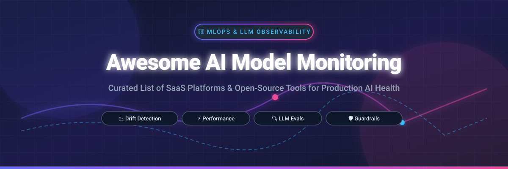

# 🤖 Awesome AI Model Monitoring & Observability

     

A curated, comprehensive ecosystem list of **SaaS platforms** and **open-source GitHub projects** dedicated to **AI Model Monitoring**, **MLOps Observability**, **Data & Concept Drift Detection**, **LLM Evaluation**, and **Production Model Quality Assurance**.

---

## 📚 Table of Contents

- [🌐 Market Overview & Sector Dynamics](#-market-overview--sector-dynamics)
- [🏢 Enterprise SaaS & Hosted Platforms](#-enterprise-saas--hosted-platforms)
- [🔓 Open-Source GitHub Projects](#-open-source-github-projects)
- [💡 Key Capabilities in AI Model Monitoring](#-key-capabilities-in-ai-model-monitoring)
- [🤝 How to Contribute](#-how-to-contribute)
- [📈 Star History](#-star-history)
- [💖 Support & Community](#-support--community)
- [⚠️ Disclaimer](#%EF%B8%8F-disclaimer)

---

## 🌐 Market Overview & Sector Dynamics

> 📊 **Estimated Market Size**: The global **AI Observability & Model Monitoring** market is estimated at **$1.8 Billion** in 2024 and projected to expand to **$7.5+ Billion by 2030** (CAGR ~30.8%).
> 
> 🧩 **Market Structure**: The sector is **moderately fragmented with rapid enterprise consolidation**. Major strategic acquisitions—such as *Arize AI by Dynatrace ($915M)*, *Galileo by Cisco*, *Aporia by Coralogix*, *TruEra by Snowflake*, and *WhyLabs by Apple*—highlight the transition toward unified enterprise observability stacks. Simultaneously, a vibrant ecosystem of specialized open-source evaluation and drift detection tools continues to thrive.

---

## 🏢 Enterprise SaaS & Hosted Platforms

Below is the comparative breakdown of commercial SaaS platforms for production ML and LLM observability, sorted by **Company Size / Valuation / Total Funding (descending)**.

| 🏢 Platform / Product | 📝 Description & Key Capabilities | 💰 Pricing (Starting Tier) | 🎁 Free Tier / Trial Limit | 📊 Company Size / Valuation / Funding |
| :--- | :--- | :--- | :--- | :--- |
| **[Monte Carlo AI](https://www.montecarlodata.com/)** 🚀 | Data and AI observability platform covering data quality, pipeline lineage, and end-to-end reliability for enterprise models. | **$15,000/year** (Enterprise starting contract) | **14-day free trial** with sandbox data assets | **$1.6B Valuation** ($236M Raised) |
| **[Arize AI](https://arize.com/)** ⚡ | Enterprise ML and LLM observability platform offering real-time performance tracking, tracing, embedding visualization & drift alerting. | **$50/month** (AX Pro tier) | **AX Free Plan** (25,000 trace spans/mo & 1 GB storage) | **$915M Acquisition** by Dynatrace ($131M Raised) |
| **[Fiddler AI](https://www.fiddler.ai/)** 🛡️ | Model performance, explainability, and real-time guardrails suite for enterprise AI, LLMs, and predictive models. | **$0.002 per trace** (Developer tier) | **Free Tier** (Real-time guardrails & hallucination checks) | **$100M Funding** (Series C) |
| **[Galileo](https://www.rungalileo.io/)** 🔍 | Comprehensive LLM evaluation, prompt quality monitoring, and hallucination guardrail observability platform. | **$100/month** (Pro plan, 50,000 traces) | **Free Tier** (5,000 trace logs per month) | **$68M Funding** (Acquired by Cisco) |
| **[Arthur AI](https://www.arthur.ai/)** 🎯 | Model monitoring, governance, safety guardrails, and compliance tracking for traditional ML and generative AI. | **$60/month** (Premium tier) | **Free Tier** (Up to 4 active model use cases) | **$65.7M Funding** ($250M Valuation) |
| **[Aporia](https://www.aporia.com/)** 📊 | Production ML monitoring and live LLM guardrails platform for drift detection, bias, and performance tracking. | **$99/month** (Starter tier) | **14-day free trial** with full platform capabilities | **$50M Acquisition** by Coralogix ($30M Raised) |
| **[TruEra](https://truera.com/)** 🧪 | ML model quality management, explainability, and diagnostic testing suite for tabular and LLM applications. | **$500/month** (Team plan) | **14-day free trial** (TruEra Diagnostics workspace) | **$42.3M Funding** (Acquired by Snowflake) |
| **[Evidently AI (Cloud)](https://www.evidentlyai.com/)** 📈 | Managed SaaS platform built on the open-source Evidently core, providing team collaboration, hosted dashboards, and evals. | **$49/month** (Expert tier) | **Free Tier** (1 project & 1,000 records/mo free forever) | **$15M Funding** (Series A) |
| **[WhyLabs](https://whylabs.ai/)** 🔐 | Privacy-first statistical data profiling and monitoring platform designed for tabular datasets and LLM prompts. | **$50/month** (Developer tier) | **Free Tier** (1 dataset/model permanent monitoring) | **$14M Funding** (Acquired by Apple) |
| **[Superwise](https://www.superwise.ai/)** 🤖 | Automated ML and LLM model monitoring platform featuring real-time drift detection and runtime security guardrails. | **$150/month** (Starter tier) | **Free Starter Plan** (1 agent & dataset + 30-day trial) | **$4.5M Funding** (Acquired by Blattner Tech) |

---

## 🔓 Open-Source GitHub Projects

Curated list of leading open-source frameworks for ML validation, data drift detection, and LLM evaluation, sorted by **GitHub Stars_Count (descending)**.

1. **[MLflow](https://github.com/mlflow/mlflow)**   
   📦 Open-source platform for the complete machine learning lifecycle, including experiment tracking, model registry, and production metric logging.

2. **[Ragas](https://github.com/explodinggradients/ragas)**   
   🎯 Evaluation framework for Retrieval-Augmented Generation (RAG) pipelines and LLM applications providing continuous metric scoring.

3. **[Great Expectations](https://github.com/great-expectations/great_expectations)**   
   🧪 Leading open-source library for data validation, automated data profiling, and pipeline monitoring before model ingestion.

4. **[Cleanlab](https://github.com/cleanlab/cleanlab)**   
   🧹 Data-centric AI framework for automatically detecting dataset errors, label noise, and out-of-distribution inputs in ML systems.

5. **[Arize Phoenix](https://github.com/arize-ai/phoenix)**   
   🔥 AI observability and evaluation library designed for tracing, benchmarking, and visual debugging of LLMs, RAG, and agentic workflows.

6. **[Evidently](https://github.com/evidentlyai/evidently)**   
   📊 Leading open-source ML and LLM observability framework featuring 100+ metrics for data drift, quality, and self-hosted monitoring UI.

7. **[River](https://github.com/online-ml/river)**   
   🌊 Dynamic Python library for online machine learning, concept drift detection, and streaming data analysis in production.

8. **[Giskard](https://github.com/giskard-ai/giskard)**   
   🛡️ Open-source evaluation and testing toolkit for AI models (LLMs & ML) to detect vulnerabilities, hallucinations, and performance degradation.

9. **[Deepchecks](https://github.com/deepchecks/deepchecks)**   
   ✅ Continuous validation and monitoring suite for tabular, NLP, and vision models across training, staging, and production environments.

10. **[TruLens](https://github.com/truera/trulens)**   
    🔬 Instrumentation and evaluation tool for LLM applications and RAG feedback loops utilizing the RAG Triad framework.

11. **[WhyLogs](https://github.com/whylabs/whylogs)**   
    📉 Lightweight, privacy-preserving data logging library for tracking statistical profiles, data drift, and quality over time.

12. **[Alibi Detect](https://github.com/SeldonIO/alibi-detect)**   
    🔍 Algorithms for outlier, adversarial, and concept drift detection across tabular, image, text, and time-series model deployments.

13. **[NannyML](https://github.com/NannyML/nannyml)**   
    🔮 Post-deployment ML performance estimation library that computes performance metrics even when ground truth labels are missing or delayed.

14. **[LangKit](https://github.com/whylabs/langkit)**   
    🔤 Open-source text metrics library designed for monitoring LLM prompts, toxicity, sentiment, and structural quality.

---

## 💡 Key Capabilities in AI Model Monitoring

Modern AI monitoring and observability systems focus on four core operational pillars:

- 📉 **Data & Concept Drift**: Detecting shifts in input data distribution (covariate shift) and changes in target variable relationships over time.
- ⚡ **Performance Estimation**: Computing accuracy, F1, precision, recall, or loss when ground truth outcomes arrive with delay or missing labels.
- 🤖 **LLM Evals & Tracing**: Monitoring token usage, latency, hallucination rate, context relevance, prompt injection threats, and agent steps.
- 🛡️ **Production Guardrails**: Intercepting malicious prompts, PII leakage, and off-topic outputs before user impact.

---

## 🤝 How to Contribute

Contributions are warmly welcomed! Please follow these simple guidelines:

1. 🍴 **Fork the repository**.
2. 📝 **Add or update entries** in `README.md` following the existing format.
3. 📌 **Include essential details**: Name, homepage/repo link, 1–2 sentence description, pricing/stars details.
4. 🚀 **Submit a Pull Request** with a brief summary of your additions.

---

## 📈 Star History

---

## 💖 Support & Community

Thank you for exploring **Awesome AI Model Monitoring**! If this repository helps your MLOps team or research project, please consider showing your support:

- ⭐ **Star this repository** to help increase visibility!
- 🔀 **Fork and Contribute** to expand open-source AI observability resources.
- 📢 **Share with colleagues** across developer and MLOps communities.
- ☕ **Sponsor the Maintainer**: Support ongoing open-source curation via the [GitHub Sponsor Dashboard](https://github.com/sponsors/ishandutta2007).

---

## ⚠️ Disclaimer

- This is a **community-curated index** for informational and educational purposes.
- Monitoring tools detect operational symptoms; root cause analysis and model retraining remain engineering responsibilities.
- Always align platform choices with your organization's data privacy, residency, and enterprise compliance rules.
